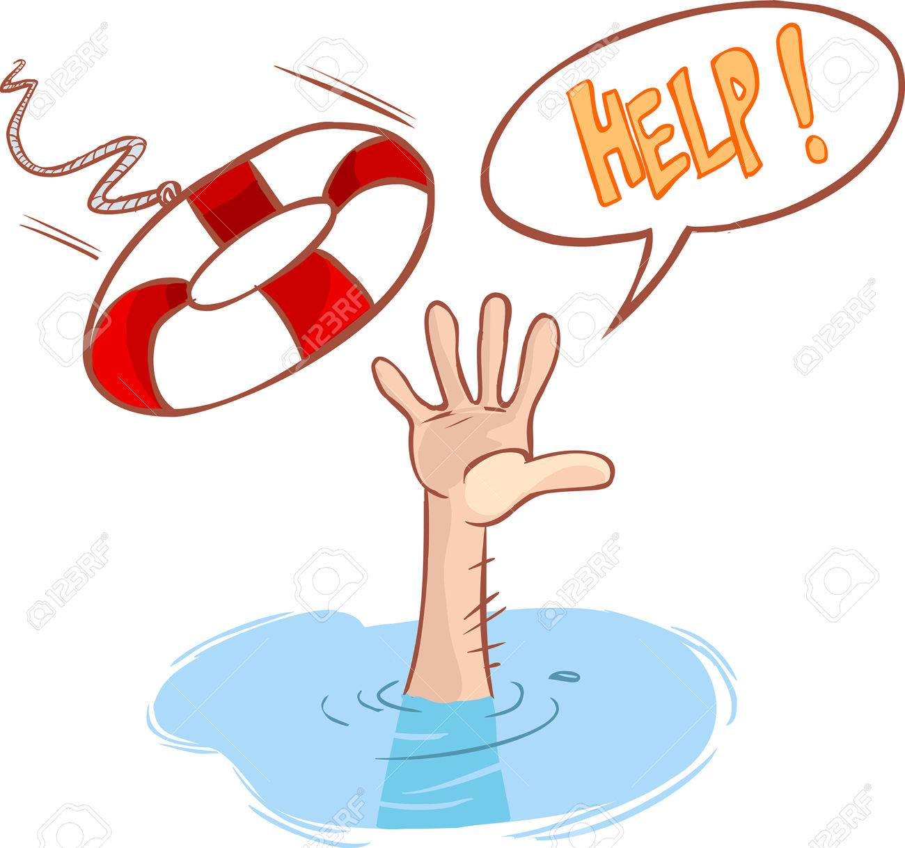
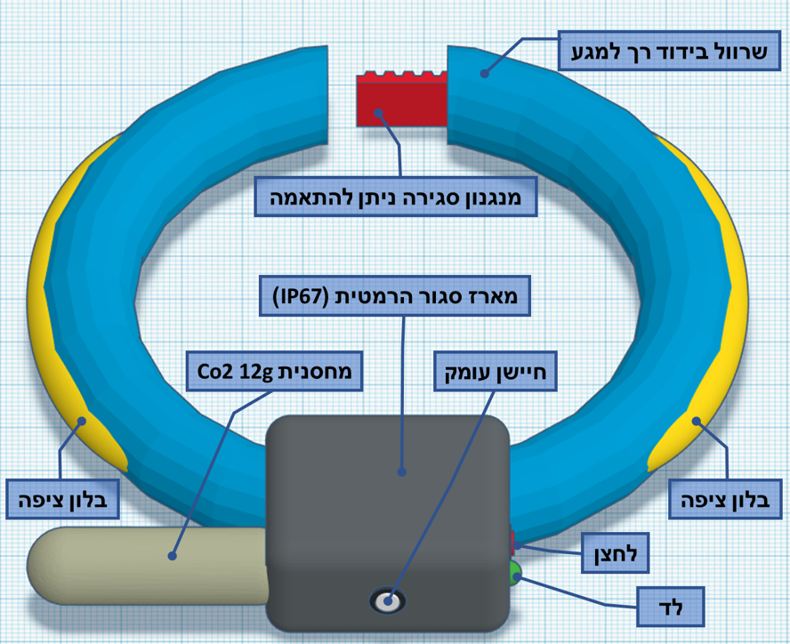
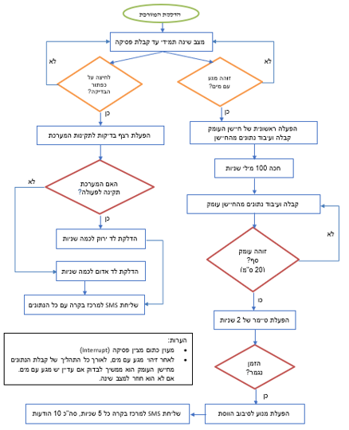
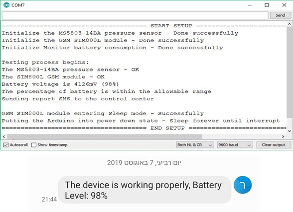
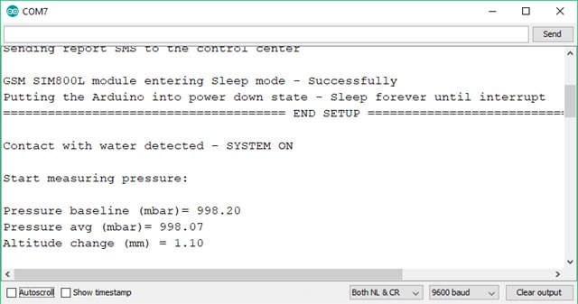
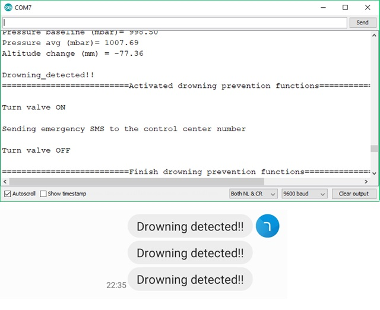

<!-- PROJECT LOGO -->

  

  <h2 align="center">Saving Children From Drowning</h2>

  

    Embedded system for saving children from drowning with the help of microcontroller and various sensors. 
    A final project as part of a bachelor's degree :mortar_board: in electrical engineering and electronics.
     
    <a href="https://github.com/Mashiyah/Preventing-Child-Drowning#introduction"><strong>Explore the docs »</strong></a>
     
     
    <a href="Code/DeBug_Version.ino">The Code</a>
    ·
    <a href="Book/ProjectBook.pdf">Final Project Book (Heb)</a>
  

<!-- TABLE OF CONTENTS -->
## Table of Contents

* [Introduction](#introduction)
  * [Purpose](#purpose)
* [System Overview](#system-overview)
  * [Main Requirements](#main-requirements)
  * [Electronic Sketch (Schematic)](#electronic-sketch)
  * [System Algorithm](#system-Algorithm)
* [Results and demos](#results-and-demos)
* [Contact](#contact)
* [Acknowledgements](#acknowledgements)

<!-- Introduction -->
## Introduction
Within the last year of electrical engineering, we have developed a drowning prevention system for children and infants.
The information presented here is the essence of the project. Literature survey, engineering design, results, demos, conclusions and much more can be found in a project book (Hebrew).

### Purpose
Injuries and deaths from drowning, especially of infants and children, have become a sad routine in Israel and around the world. 
Drowning is the second cause of mortality in children. 
Imprints are usually caused by the absence of supervision, even by a few seconds. It can happen at sea or at the pool.
Because of this important problem, it was decided to develop a system that integrates hardware and software that will recognize a drowning case in children and provide a quick and correct response to save the child's life while drowning. 
The system is for children aged 0-8 who cannot swim and should not enter the water without adult supervision.

<!-- System overview -->
## System Overview

### Main Requirements
The system is responsible for identifying the drowning and operating the various mechanisms to save the child if necessary. 
The electrical system includes a microcontroller, motor, power source, GSM component and various sensors that will monitor the depth of the child in the water. 
When the child is at a certain depth for a predetermined amount of time, the electrical system will operate different mechanisms to save the child.  
A first mechanism and the main requirement of the system is the ability to raise the child's head above the water and keep it in this position. Responding to this requirement avoids contact with the airways leading to suffocation.  
A second mechanism is to send an emergency message (SMS) to a control center, where the event will operate, sending an SMS message back to the parents. This mechanism meets the requirement for parental attention. There is also a button to check the system's integrity. In response to a click, you will send an SMS with a detailed health report.

  

### Electronic Sketch (Schematic)
Schematic of the electrical system in the project. 
In addition, the circuit also has a power button ,check button, resistors and LED.
  

### System Algorithm

  

<!-- Results and demos -->
## Results and demos
Many more examples and results can be seen in a project book.

### The system performs a general integrity check after turning it on
One of the requirements is to perform a general automated system check to verify the system's integrity after wearing the child's chain.
When the system is turned on, it performs a round of tests for the system components. If all is correct, it sends a message to a control center with the test details and a green LED indicating that the system is working properly. 
If there is a problem it reports to a control center and turns on a red LED indicating that there is a problem with the system.

  

 As you can see in the following pictures, the system responds as expected and according to the requirement we set.

### Receiving and processing data from the depth sensor
One of the requirements is to identify the depth at which the baby / child is present when it is originally water. 
To do this, the system uses a pressure sensor to measure the pressure at any given moment. 
After measuring, it calculates the depth at which the baby / child is found.

  

As you can see in the following pictures, the system responds as expected and according to the requirement we set.

### Inflating balloons floated and sending emergency messages

  

As you can see in the following pictures, the system responds as expected and according to the requirement we set.

<!-- CONTACT -->
## Contact
 - :email: Ran.mash@gmail.com  
 - :information_source: [@linkedin](linkedin.com/in/ran-mashiyah)

<!-- ACKNOWLEDGEMENTS -->
## Acknowledgements
* [LowPower](https://github.com/rocketscream/Low-Power)
* [BatterySense](https://github.com/rlogiacco/BatterySense)
* [SparkFun_MS5803](http://librarymanager/All#SparkFun_MS5803-14BA)
